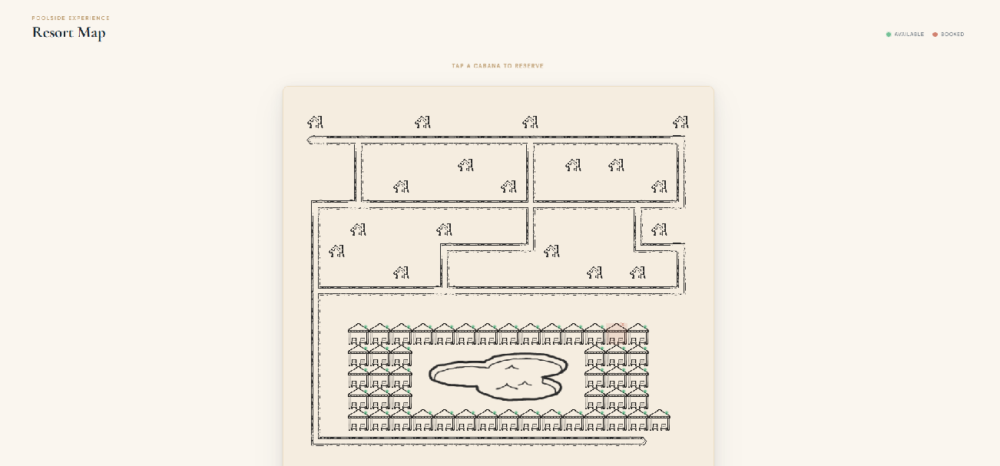

```markdown
# Resort Cabana Booking

Interactive resort map with real-time cabana availability and poolside booking.

🌐 **Live demo:** [resort-booking-xi.vercel.app](https://resort-booking-xi.vercel.app)

> **Note:** Backend is hosted on Render free tier and may take up to 30 seconds
> to wake up on the first request.




---

## Quick Start

```bash
npm install
npm run dev
```

Open [http://localhost:5173](http://localhost:5173)

### Custom map and bookings files

```bash
npm run dev -- --map ./path/to/map.ascii --bookings ./path/to/bookings.json
```

---

## Requirements

- Node.js 18+
- npm 9+

---

## Stack

| Layer        | Technologies                      |
|:-------------|:----------------------------------|
| **Frontend** | React 18, TypeScript, Vite, SCSS  |
| **Backend**  | Fastify 5, TypeScript, tsx        |

---

## Project Structure

```
resort-booking/
├── frontend/
│   └── src/
│       ├── api/            # fetch wrappers
│       ├── components/
│       │   ├── CabanaModal/  # booking modal (form, success, booked views)
│       │   └── MapGrid/      # map renderer, cell, pool image
│       ├── constants/      # CELL_SIZE, TILE_MAP
│       ├── types/          # shared interfaces
│       └── utils/          # pathTile, poolBounds
└── backend/
    └── src/
        ├── routes/         # GET /api/map, POST /api/book
        ├── utils/          # file parser
        └── store.ts        # in-memory Set<string>
```

---

## API

### `GET /api/map`

Returns the resort map, cabana positions, and currently booked cabana ids.

```json
{
  "map": [[".", "#", "W"]],
  "cabanas": ["1-2"],
  "booked": []
}
```

### `POST /api/book`

Books a cabana. Validates room number and guest name against bookings file.

```json
// Request
{ "roomNumber": "101", "guestName": "Alice Smith", "cabanaId": "11-3" }

// Success
{ "success": true }

// Error
{ "error": "Invalid room number or guest name" }
```

---

## Running Tests

```bash
# All tests
npm test

# Backend only
npm run test:backend

# Frontend only
npm run test:frontend
```

### What is tested

| Area | Tests |
|:-----|:------|
| Booking logic | valid guest, invalid guest, double booking, missing fields |
| REST API | GET /api/map response shape, POST /api/book all cases |
| Path tile logic | straight, corner, T-junction, crossing, dead end |
| Pool bounds | correct bounds calculation, null when no pool |
| Modal UI | form render, booked state, empty fields error, API error, success screen, overlay close |

---

## Architecture

### Map rendering

The ASCII map is parsed server-side and sent as a 2D array. Each cell is
rendered as a 48×48px tile. Path tiles (`#`) use a neighbour-detection
algorithm — `getPathTile` checks 4 adjacent cells and selects the correct
image and CSS rotation angle, producing a visually connected path network
without any path metadata.

### Pool as a single element

Instead of rendering one image per `p` cell, a single `` is stretched
across all pool cells using `position: absolute`. Its pixel coordinates are
computed dynamically via `ResizeObserver`, so it adapts to any cell size
including mobile breakpoints.

### Validation without authentication

Per the spec, knowing a room number and guest name is sufficient to book.
The backend looks up the pair in the loaded bookings file — no sessions,
no tokens. Simple and correct for the use case.

### In-memory state

Bookings are stored in a `Set<string>` in the server process. This resets
on restart, which is acceptable per the spec. A persistent store (Redis,
SQLite) could be added as a drop-in replacement for the `store.ts` module.

### CLI arguments

`--map` and `--bookings` are parsed in `server.ts` and passed to route
plugins via Fastify plugin options. Files are loaded once at startup —
no per-request filesystem reads.

---

## Tradeoffs & Simplifications

| Decision | Reason |
|:---------|:-------|
| In-memory bookings | Spec explicitly allows it |
| No auth | Room + name match is sufficient per spec |
| Single pool block | Parser assumes one rectangular `p` region |
| No optimistic UI | Keeps booking flow simple and reliable |
| tsx in production | Avoids a build step; acceptable for this scale |
```
